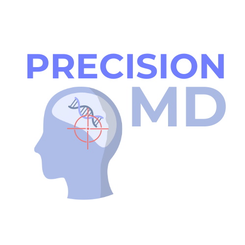

# PrecisionMD
## Project Description
PrecisionMD is a software that utilizes a SVM machine learning model to create a personalized medicine tool for doctors. For a patient diagnosed with depression, it predicts the top two most effective antidepressants based on their genetic makeup and demographics, to maximize treatment success rates.

## Prototype Demo
[](https://precisionmd.streamlit.app/)

## Usage 
Navigate to the Patients page and click on the "Add Patient" button to generate a new patient entry.


Input the patient's information and click the "Generate Report" button to see the top two recommended medications and associated top 5 drug reactions reported to the FDA.

[](https://www.youtube.com/watch?v=Jp51wBdoBf8)

## Installation Instructions:
### Run it Locally
```sh
virtualenv .venv
source .venv/bin/activate
pip install -r requirements.txt
streamlit run app.py
```


